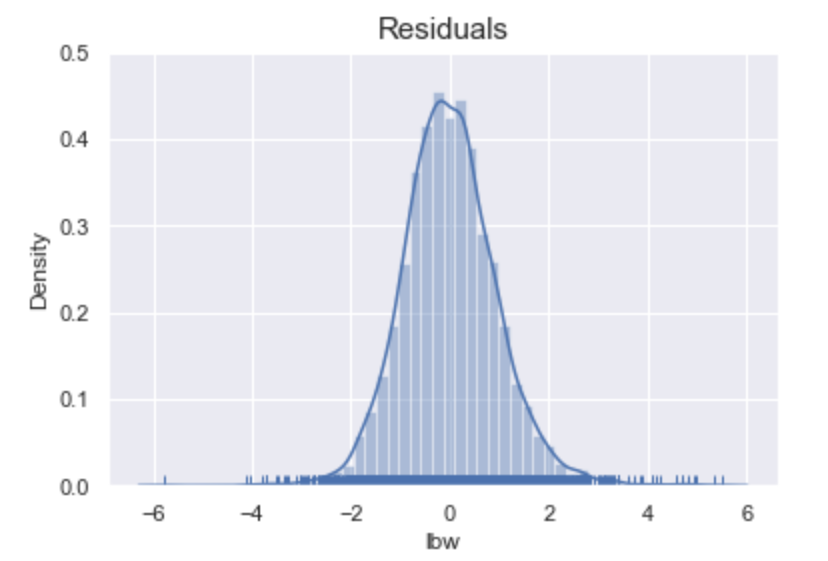

# Low Birth Weight Percentages
**Author: Jaclyn Dwyer**


## Overview
To help Kaiser Permanente determine how to identify areas that need higher level NICUs, the goal of this project is to predict the percentage of low birth weight (LBW) births in California census tracts based off their population characteristics and environmental health hazards. The models are evaluated using RMSE scores and R-Squared scores.

## Background Information

### Low Birth Weight (LBW)
Babies born at LBW are babies born at less than 5.5lbs. Two reasons why babies are born at LBW include babies being born early or restricted growth for the babies while in the womb. Babies born at LBW are placed in the neonatal intensive care unit (NICU) as they require significant help in order to help them thrive. LBW babies can require help with things such as low oxygen levels, can require feeding tubes to help with weight gain, and are at risk for brain hemorrhaging. LBW are at risk for health problems later in life including blindness, deafness, diabetes, and heart disease. 
(To visit the source of information, or to read more about LBW, please visit the site [here](https://www.marchofdimes.org/complications/low-birthweight.aspx))

### Why population characteristics?
Certain population characteristics have been associated with LBWs including education and ethnicity. Women with less education have been linked to an increased risk of LBW newborns [(Study).](https://www.ncbi.nlm.nih.gov/pmc/articles/PMC3349660/) Additionally, Certain ethnicities have been shown to have an increase risk for LBWs [(Source).](https://www.marchofdimes.org/peristats/Peristats.aspx)

### Why environmental health hazards?
Certain environmental health hazards have been linked to increase risks of LBW newborns. Particulate matter exposure during pregnancy has been associated with LBWs in newborns [(Study).](https://www.ncbi.nlm.nih.gov/pmc/articles/PMC1913584/) LBW has been shown to be linked with exposure to air pollutants from vehicle emissions [(Study).](https://pubmed.ncbi.nlm.nih.gov/22586068/) Additionally, studies have indicated that pregnant women living near cleanup sites have an increased chance of having a low birth weight male [(Study).](https://pubmed.ncbi.nlm.nih.gov/12896858/)

## Methods
The methodology for this project includes data cleaning, exploratory data analysis, feature engineering, and running various models to determine the model with the lowest RMSE score and highest R-Squared score. 

## Data
The data was obtained from California Communities Environmental Health Screening Tool reports (CalEnviroScreen) released by the Office of Environmental Health Hazard Assessment (OEHHA). These reports aim to identify California census tracts that are burdened and vulnerable to multiple pollution sources by looking at features including environmental pollution levels and population characteristics. Three different datasets are cleaned and used for this project including the the [CalEnviroScreen 3.0 report](https://oehha.ca.gov/calenviroscreen/report/calenviroscreen-30), the [demographic profile for the CalEnrivoScreen 3.0 report](https://oehha.ca.gov/calenviroscreen/report/calenviroscreen-30), and the [CalEnviroSreen 2.0 report](https://oehha.ca.gov/calenviroscreen/report/calenviroscreen-version-20). The CalEnviroScreen 3.0 report is the main data used for this project, while the other data sets are used to help achieve accurate predictions. 

## Data Preparation 
The data included information for 8,035 California census tracts with 56 columns. Certain columns not pertinent to the business problem are dropped as well as row with zero population or missing LBWs. Previous environmental hazard information was added from the CalEnviroScreen 2.0 report, demographic information was added from the CalEnviroScreen 3.0 report, and smoking prevalence was added from data obtained through [CHIS](https://ask.chis.ucla.edu/ask/SitePages/AskChisLogin.aspx?ReturnUrl=%2fAskCHIS%2ftools%2f_layouts%2fAuthenticate.aspx%3fSource%3d%252FAskCHIS%252Ftools%252F%255Flayouts%252FAskChisTool%252Fhome%252Easpx&Source=%2FAskCHIS%2Ftools%2F%5Flayouts%2FAskChisTool%2Fhome%2Easpx). 

## Exploratory Data Analysis
Statistical tests and visualizations are run to further analyze the data, especially for features which have been shown to be linked to LBWs as stated above. Statistical t-tests are run to determine if certain groups' mean LBW percentages were statistically different. Boxplots and bar graphs are created to further explore the statistically different groups. 

**Ethnicity**


The graph shows that populations with "more" Hispanics, African Americans, and Asian Americans have a higher mean LBW percentage. On the contrary, populations with "more" Caucasians have a lower mean LBW%.

**Particulate Matter (PM 2.5)**

The higher amount of PM 2.5 the higher mean LBW percentages for those census tracts.

**Traffic Density**

The higher amount of traffic the higher the mean LBW percentages for those census tracts.

**Cleanup Sites**

The higher amount of cleanup sites the higher the mean LBW percentages for those census tracts. 

## Models
Models are created in order to obtain the best predictions for percentage of LBW based off of population characteristics and environmental health hazards and are evaluated using RMSE scores and R-Squared scores. Since a good R-Squared score is relative to the field being studied, a benchmark score is needed. According to [researchgate](https://www.researchgate.net/) an acceptable R-Squared score in the scientific community is above 0.5. Therefore, the goal for the final model is to get a low RMSE score and R-Squared score above 0.5. Linear regression and random forest models are created. During this process interactions for all variables are created to try and achieve better scores. Following this, select k best and recursive feature elimination (RFE) are used to prevent overfitting. 

## The Final Model 
The model that performed the best was a linear regression model using the selected features from RFE. There were 98 selected RFE features, 30 of which were significant for predictions when analyzed using an ols summary. This model achieved RMSE scores of ~0.97 on the train and test sets. Evaluating the RMSE score determined that the model is off by about 0.06 on average compared to the entire range of the target variable. The final model accounted for ~62% of variance in the train set and ~58% of variance in the test set. Finally, assumptions were checked indicating that the residuals appear Homoscedastic and normal. 




## Next Steps: 
Some future steps to improve this project include:
  - Adding in clustering to help with predictions
  - Running gradient tree boosting and XGBoost models to see if better predictions are achieved
  - Creating a causal inference model
  - Designing a Streamlit app

## Repository Structure
```
├── data
├── experiment_notebooks
├── images
├── final_notebook
├── README.md
└── presentation.pdf

```
